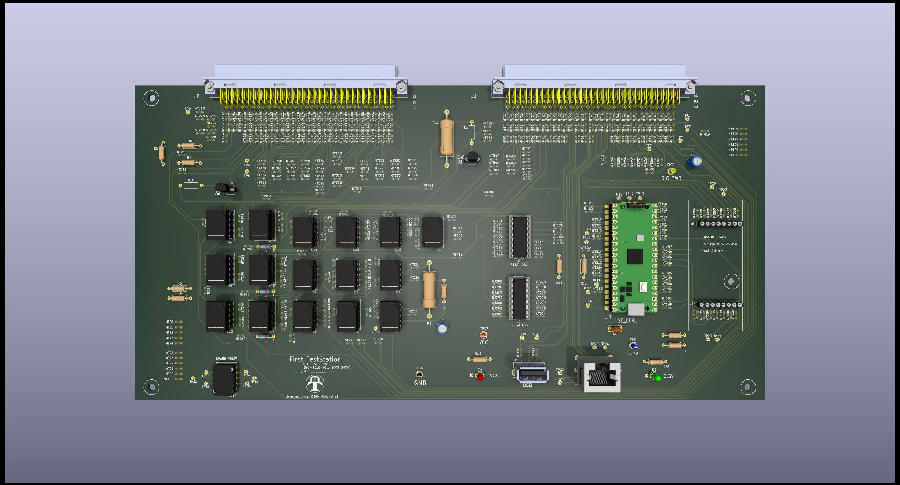

# FIRST STATION TEST Selftest Box Assembly 500-1010-021

## Project Overview
This project involves the assembly of a custom **Selftest Circuit Board (PCB)** designed to be part of the **First TestStation** project ([FTS](https://dlock8.github.io/FTS_Website/)). 
The primary goal of the selftest board is to provide the necessary electronics and multiple connections to validate the [Interconnect IO Box](https://github.com/dlock8/InterconnectIO_Box). 

## Note
Due to minor additions, the Selftest Board Assembly has been updated to become the Selftest Box Assembly. The documentation for these updates has been included in the same repository.

## Documentation

- [Bill of Materials (BOM)](selftest_bd/pdf/BOM_Selftest_Box_510-1010.pdf) – List of components required for assembly.

 
 

# FIRST STATION TEST Selftest Board Assembly 600-1010-021

This section contains the materials and instructions required to assemble the Selftest Board.

 

### Design Tools
- [KiCad 7](https://www.kicad.org/download/) - Free software application used to design the PCB.
- [LibreOffice](https://www.libreoffice.org/download/download-libreoffice/) - Free Software application used to create assembly instructions and the Bill of Materials (BOM).
- [PicPick](https://picpick.app/en/) - Free application to capture and document image.

---
### Features
- **Easy Hand Assembly**: Designed with only through-hole components, making it easy to assemble by hand.
- **Socketed Active Components**: To facilitate easy replacement without unsoldering, most active components are mounted on sockets.
- **Cost-Effective Controller**: The low-cost and powerful **Raspberry Pi Pico Microcontroller** is used to interface with the user and control internal electronics.

## Assembly Instructions
   Follow the document [Assembly_Instructions](selftest_bd/pdf/Selftest_Assembly_Instruction_680-1010.pdf) to complete the assembly of the board.

## Design Files
- [Gerber Files](https://github.com/dlock8/Selftest_Board/tree/main/selftest_bd/gerber_to_order) – Gerber files for PCB fabrication (JLCPCB is the one used by the project).
- [Assembly Schematic](selftest_bd/pdf/Selftest_Assembly_Diagram_670-1010.pdf) – Parts and value to help hand assemblies of components.
- [Electrical Schematic](selftest_bd/pdf/Selftest_Schematic_640-1010.pdf) – Review the full electrical schematic diagram for reference.
- [Bill of Materials (BOM)](selftest_bd/pdf/BOM_Selftest_Board_610-1010.pdf) – List of components required for assembly.

---

## License

This project is licensed under the terms of the [CERN Open Hardware Licence Version 2 - Weakly Reciprocal (CERN-OHL-W 2.0)](https://ohwr.org/cern_ohl_w_v2.txt).

See the [LICENSE](./LICENSE) file in this repository for more details.

---

## History
- **Version 1.0**: The initial version of the PCB (600-1010-010) was assembled and tested. However, the main connectors J1 and J2 were reversed, making the board unusable.
- **Version 2.0**:This version includes corrections to the connector errors. The board was assembled and tested, but errors were found in the wiring of the USB and RJ45 connectors.
- **Version 2.1**: This version addresses all errors identified in Version 2.0. As of now, Version 2.1 has not yet been assembled or tested.
---

## Contact
For any issues or further questions, feel free to contact me at [daniellockhead@gmail.com] or open an issue on GitHub.
